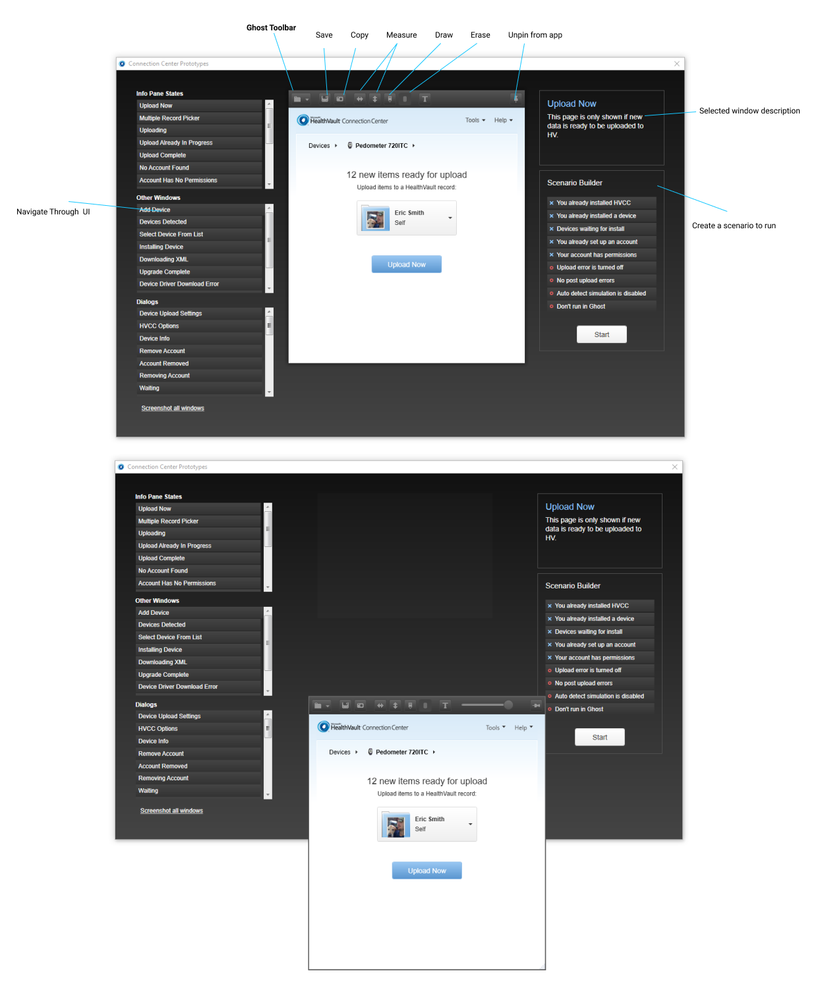

# HealthVault Connection Center Prototype using Ghost features 

I built this back in 2010 to provide a prototype that could be used to test use cases and be used in usability studies. As a side project, I also took the Ghost concept and applied it to a WPF application by wrapping the UI around Ghost functionality. 

_Note: Rooler was not built by me. This was shared by another worker at Microsoft_

### Goals
- Create a prototype that allowed for different user flows
- Allow a developer to quickly obtain measurements 
- Allow developers to draw on top of work and save 
- Allow Usability Researchers to setup scenarios to test
- Allow Design to skip the redlining process

